# Uganda E-Gov WhatsApp Helpdesk - System Architecture

## High-Level Architecture Diagram

```mermaid
graph TB
    %% External Users and Services
    subgraph "External Layer"
        U1[👥 45M+ Ugandan Citizens]
        U2[📱 WhatsApp Business API]
        U3[🌐 Web Users]
        U4[👨‍💼 Admin Users]
        
        %% Government Services
        NIRA[🎫 NIRA<br/>Birth Certificates]
        URA[💼 URA<br/>Tax Services]
        NSSF[🏦 NSSF<br/>Pension Services]
        NLIS[🌿 NLIS<br/>Land Records]
    end

    %% API Gateway Layer
    subgraph "API Gateway Layer"
        LB[⚖️ Load Balancer<br/>Nginx/CloudFlare]
        RL[🚦 Rate Limiter<br/>SlowAPI]
        CORS[🔗 CORS Handler]
    end

    %% Application Layer
    subgraph "Application Layer"
        subgraph "FastAPI Main Application"
            MAIN[🚀 main.py<br/>FastAPI Server]
            WH[📞 WhatsApp Webhook<br/>/whatsapp/webhook]
            ADMIN[👨‍💼 Admin API<br/>/admin/*]
            HEALTH[❤️ Health Checks<br/>/health, /ready]
        end
        
        subgraph "WhatsApp Clone"
            CLONE[🌐 WhatsApp Clone<br/>Web Interface]
            PWA[📱 PWA Support<br/>Service Worker]
        end
    end

    %% Agent System Layer
    subgraph "Google ADK Agent System"
        subgraph "Core Agents"
            ROOT[🤖 Root Agent<br/>Orchestrator]
            USER_ID[👤 User ID Agent<br/>Phone Validation]
            LANG[🗣️ Language Agent<br/>Multi-language]
            INTENT[🎯 Intent Agent<br/>Classification]
            HELP[❓ Help Agent<br/>General Assistance]
        end
        
        subgraph "Service Agents"
            BIRTH[🎫 Birth Agent<br/>NIRA Integration]
            TAX[💼 Tax Agent<br/>URA Integration]
            PENSION[🏦 NSSF Agent<br/>Pension Services]
            LAND[🌿 Land Agent<br/>NLIS Integration]
            FORM[📋 Form Agent<br/>Document Processing]
        end
        
        subgraph "ADK Infrastructure"
            RUNNER[🏃 ADK Runner<br/>Agent Execution]
            SESSION_SVC[💾 Session Service<br/>In-Memory]
            EVENT_BUS[📡 Event Bus<br/>Agent Communication]
        end
    end

    %% MCP Server Layer
    subgraph "MCP (Model Context Protocol) Servers"
        subgraph "Browser Automation"
            PLAYWRIGHT[🎭 Playwright MCP<br/>Primary Automation]
            BROWSER_USE[🌐 Browser-Use MCP<br/>Fallback Automation]
        end
        
        subgraph "Specialized Tools"
            AUTH_TOOLS[🔐 Auth Tools<br/>User Validation]
            WHATSAPP_TOOLS[📱 WhatsApp Tools<br/>Message Handling]
            INTERNAL_TOOLS[🔧 Internal Tools<br/>System Integration]
        end
    end

    %% Data Layer
    subgraph "Data & Storage Layer"
        subgraph "Primary Database"
            SUPABASE[🗄️ Supabase<br/>PostgreSQL + Real-time]
            USERS_TBL[(👥 Users Table)]
            SESSIONS_TBL[(💬 Chat Sessions)]
            MESSAGES_TBL[(📝 Messages Table)]
        end
        
        subgraph "Caching Layer"
            REDIS[⚡ Redis Cache<br/>Session Storage]
            SERVER_CACHE[💾 Server Cache<br/>Local Storage]
        end
        
        subgraph "Session Management"
            SIMPLE_SM[🔄 Simple Session Manager<br/>2hr timeout, 2-day TTL]
            ADK_SM[🤖 ADK Session Manager<br/>Per-interaction sessions]
        end
    end

    %% Monitoring & Analytics Layer
    subgraph "Monitoring & Analytics"
        subgraph "Real-time Monitoring"
            MONITOR[📊 Monitoring Service<br/>System Health]
            METRICS[📈 Metrics Collection<br/>Performance Data]
            ALERTS[🚨 Alert System<br/>Error Tracking]
        end
        
        subgraph "Logging & Tracing"
            LOGS[📋 Structured Logging<br/>JSON Format]
            TELEMETRY[🔍 OpenTelemetry<br/>Distributed Tracing]
            AUDIT[📝 Audit Trail<br/>Admin Actions]
        end
    end

    %% Infrastructure Layer
    subgraph "Infrastructure & Deployment"
        subgraph "Container Platform"
            DOCKER[🐳 Docker<br/>Containerization]
            COMPOSE[🔧 Docker Compose<br/>Local Development]
            K8S[☸️ Kubernetes<br/>Production Orchestration]
        end
        
        subgraph "Cloud Services"
            GCP[☁️ Google Cloud Platform<br/>Primary Cloud]
            CLOUD_RUN[🏃 Cloud Run<br/>Serverless Containers]
            VERTEX_AI[🧠 Vertex AI<br/>Agent Engine]
        end
        
        subgraph "Security & Auth"
            JWT[🔑 JWT Authentication<br/>Admin Access]
            RATE_LIMIT[🚦 Rate Limiting<br/>API Protection]
            ENCRYPTION[🔒 Data Encryption<br/>Sensitive Data]
        end
    end

    %% External Integrations
    subgraph "External Integrations"
        TWILIO[📞 Twilio<br/>WhatsApp Backup]
        GOOGLE_OAUTH[🔐 Google OAuth<br/>Web Authentication]
        OPENAI[🤖 OpenAI/Gemini<br/>LLM Models]
    end

    %% Data Flow Connections
    U1 --> U2
    U2 --> LB
    U3 --> LB
    U4 --> LB
    
    LB --> RL
    RL --> CORS
    CORS --> MAIN
    
    MAIN --> WH
    MAIN --> ADMIN
    MAIN --> HEALTH
    MAIN --> CLONE
    
    WH --> ROOT
    CLONE --> ROOT
    
    ROOT --> USER_ID
    ROOT --> LANG
    ROOT --> INTENT
    ROOT --> HELP
    
    INTENT --> BIRTH
    INTENT --> TAX
    INTENT --> PENSION
    INTENT --> LAND
    INTENT --> FORM
    
    BIRTH --> PLAYWRIGHT
    TAX --> PLAYWRIGHT
    PENSION --> PLAYWRIGHT
    LAND --> PLAYWRIGHT
    
    PLAYWRIGHT --> NIRA
    PLAYWRIGHT --> URA
    PLAYWRIGHT --> NSSF
    PLAYWRIGHT --> NLIS
    
    ROOT --> RUNNER
    RUNNER --> SESSION_SVC
    RUNNER --> EVENT_BUS
    
    MAIN --> SIMPLE_SM
    SIMPLE_SM --> SERVER_CACHE
    SESSION_SVC --> REDIS
    
    MAIN --> SUPABASE
    SUPABASE --> USERS_TBL
    SUPABASE --> SESSIONS_TBL
    SUPABASE --> MESSAGES_TBL
    
    MAIN --> MONITOR
    MONITOR --> METRICS
    MONITOR --> ALERTS
    MONITOR --> LOGS
    
    ADMIN --> MONITOR
    ADMIN --> SIMPLE_SM
    ADMIN --> SUPABASE
    
    %% Styling
    classDef userClass fill:#e1f5fe,stroke:#01579b,stroke-width:2px
    classDef apiClass fill:#f3e5f5,stroke:#4a148c,stroke-width:2px
    classDef agentClass fill:#e8f5e8,stroke:#1b5e20,stroke-width:2px
    classDef dataClass fill:#fff3e0,stroke:#e65100,stroke-width:2px
    classDef infraClass fill:#fce4ec,stroke:#880e4f,stroke-width:2px
    classDef govClass fill:#f1f8e9,stroke:#33691e,stroke-width:2px
    
    class U1,U2,U3,U4 userClass
    class MAIN,WH,ADMIN,HEALTH,CLONE apiClass
    class ROOT,USER_ID,LANG,INTENT,HELP,BIRTH,TAX,PENSION,LAND,FORM agentClass
    class SUPABASE,REDIS,SERVER_CACHE,SIMPLE_SM dataClass
    class DOCKER,K8S,GCP,CLOUD_RUN infraClass
    class NIRA,URA,NSSF,NLIS govClass
```



## Detailed Component Architecture

### 1. **User Interface Layer**
```
📱 WhatsApp Business API ←→ 🌐 Web Clone ←→ 👨‍💼 Admin Dashboard
                    ↓
              ⚖️ Load Balancer & Rate Limiting
                    ↓
              🚀 FastAPI Application Server
```

### 2. **Agent System Architecture**
```
🤖 Root Agent (Orchestrator)
    ├── 👤 User Identification Agent
    ├── 🗣️ Language Detection Agent  
    ├── 🎯 Intent Classification Agent
    ├── ❓ Help & General Agent
    └── 📋 Service Routing
         ├── 🎫 Birth Certificate Agent (NIRA)
         ├── 💼 Tax Services Agent (URA)
         ├── 🏦 Pension Agent (NSSF)
         ├── 🌿 Land Records Agent (NLIS)
         └── 📋 Form Processing Agent
```

### 3. **Data Flow Architecture**
```
📱 User Message → 📞 Webhook → 🔄 Session Check → 🤖 Agent Processing
                                      ↓
🗄️ Supabase Storage ← 💾 Session Update ← 🎭 Browser Automation
                                      ↓
📊 Monitoring & Analytics ← 📝 Response Generation → 📱 User Response
```

### 4. **Session Management Architecture**
```
🔄 Simple Session Manager (User Conversations)
    ├── 💾 Server Cache (2-day TTL)
    ├── ⏰ 2-hour Activity Timeout
    └── 📝 Conversation History (50 messages)

🤖 ADK Session Manager (Agent Execution)
    ├── 💭 In-Memory Sessions
    ├── 🔄 Per-Interaction Creation
    └── 🧠 Agent State Management
```

### 5. **Monitoring & Analytics Architecture**
```
📊 Real-time Monitoring Service
    ├── 📈 Performance Metrics
    ├── 🚨 Error Tracking & Alerts
    ├── 📋 Structured Logging
    ├── 👥 User Session Analytics
    ├── 🎯 Service Success Rates
    └── 🌍 Language Usage Statistics
```

## Technology Stack

### **Backend Technologies**
- **Framework**: FastAPI (Python 3.8+)
- **Agent System**: Google ADK (Agent Development Kit)
- **Database**: Supabase (PostgreSQL + Real-time)
- **Caching**: Redis + Server-side Cache
- **Authentication**: JWT + Google OAuth
- **Monitoring**: OpenTelemetry + Custom Metrics

### **Frontend Technologies**
- **Admin Dashboard**: HTML5 + CSS3 + Vanilla JavaScript
- **Charts**: Chart.js
- **PWA**: Service Workers + Web App Manifest
- **Real-time Updates**: WebSocket + Polling

### **Infrastructure Technologies**
- **Containerization**: Docker + Docker Compose
- **Orchestration**: Kubernetes
- **Cloud Platform**: Google Cloud Platform
- **Serverless**: Google Cloud Run
- **CI/CD**: Cloud Build + GitHub Actions

### **Integration Technologies**
- **WhatsApp**: Business API + Twilio (backup)
- **Browser Automation**: Playwright + Browser-Use
- **Government APIs**: Direct integration with NIRA, URA, NSSF, NLIS
- **AI Models**: Gemini 2.0 Flash + LiteLLM support

## Security Architecture

### **Authentication & Authorization**
```
🔐 Multi-layer Security
    ├── 🔑 JWT Authentication (Admin)
    ├── 🌐 Google OAuth (Web Users)
    ├── 📱 WhatsApp Verification
    ├── 🚦 Rate Limiting (API Protection)
    ├── 🔒 Data Encryption (Sensitive Data)
    └── 🛡️ Input Validation & Sanitization
```

### **Data Protection**
- **Encryption at Rest**: Database encryption
- **Encryption in Transit**: HTTPS/TLS
- **Session Security**: Secure session tokens
- **Audit Logging**: Complete action tracking
- **Access Control**: Role-based permissions

## Scalability & Performance

### **Horizontal Scaling**
- **Load Balancing**: Multiple application instances
- **Database Scaling**: Supabase auto-scaling
- **Cache Distribution**: Redis clustering
- **Agent Scaling**: ADK multi-instance support

### **Performance Optimization**
- **Response Time**: < 2 seconds average
- **Throughput**: 1000+ concurrent users
- **Availability**: 99.9% uptime target
- **Cache Hit Rate**: > 80% for frequent queries

## Deployment Architecture

### **Development Environment**
```
💻 Local Development
    ├── 🐳 Docker Compose
    ├── 🔄 Hot Reload
    ├── 📊 Local Monitoring
    └── 🧪 Test Database
```

### **Production Environment**
```
☁️ Google Cloud Platform
    ├── 🏃 Cloud Run (Auto-scaling)
    ├── 🗄️ Supabase (Managed Database)
    ├── ⚡ Redis (Managed Cache)
    ├── 📊 Cloud Monitoring
    ├── 🔍 Cloud Logging
    └── 🚨 Cloud Alerting
```

## Data Architecture

### **Database Schema**
```sql
-- Users Table
users (id, email, name, phone, created_at, last_login, login_method)

-- Chat Sessions Table  
chat_sessions (id, user_id, title, created_at, updated_at, message_count, is_active)

-- Messages Table
messages (id, user_id, session_id, content, message_type, timestamp, 
         processing_time_ms, ai_model, intent_classification, metadata)

-- System Logs Table
system_logs (id, timestamp, level, service, event, message, metadata)
```

### **Cache Strategy**
- **Session Data**: 2-hour TTL, 2-day max
- **User Context**: 1-hour TTL
- **API Responses**: 15-minute TTL
- **Static Data**: 24-hour TTL

This architecture provides a robust, scalable, and maintainable system capable of serving Uganda's 45+ million citizens with government services through WhatsApp, while maintaining high performance, security, and reliability standards.