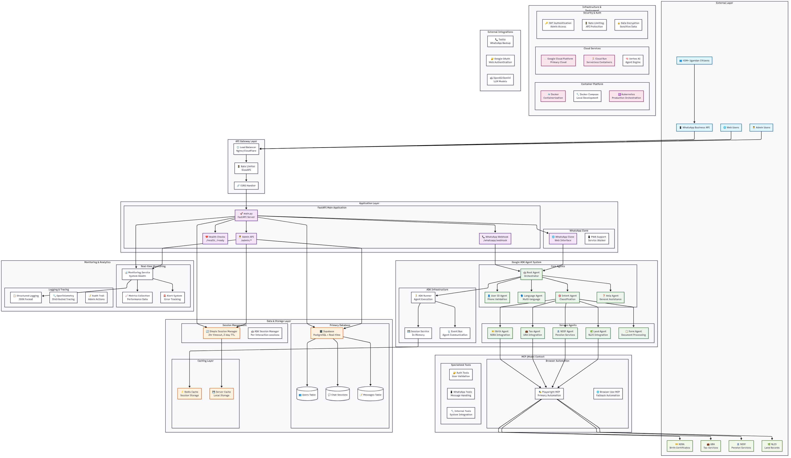

# 🇺🇬 Uganda E-Gov WhatsApp Helpdesk - Full Stack Application

A comprehensive multi-agent AI system that enables 45+ million Ugandans to access critical government services through WhatsApp, featuring a powerful admin dashboard for complete system control

> **Google ADK Hackathon 2025 Submission**  
> *Building the Future of Government Services with Multi-Agent AI*

## 🏆 Project Highlights

### 🌟 Primary User Interface: WhatsApp
- **WhatsApp-First Approach**: Designed for seamless interaction through WhatsApp Business API
- **No Public API Access**: This is a demonstration project - the API is not available for public/free use
- **WhatsApp Business API Integration**: Direct integration with Meta's WhatsApp Business API

### 🚀 Built for Google ADK Hackathon 2025
This project is our submission for the [Agent Development Kit Hackathon with Google Cloud](https://cloud.google.com/blog/topics/developers-practitioners/join-the-agent-development-kit-hackathon-with-google-cloud), focusing on:
- **Multi-Agent Collaboration**: Leveraging Google's Agent Development Kit (ADK) to create autonomous agents that work together
- **Complex Process Automation**: Streamlining government service access through intelligent agent orchestration
- **Real-world Impact**: Solving meaningful challenges in public service delivery

## 🌟 Project Overview

This production-ready application is built with a WhatsApp-first approach, enabling Ugandan citizens to access government services through a conversational interface. The system leverages Google's ADK to create a sophisticated multi-agent system that handles complex workflows across multiple government agencies.

**Key Features**:
- **WhatsApp Business API Integration** - Direct integration with Meta's WhatsApp Business API
- **Multi-Agent Architecture** - Google ADK-powered agents for intelligent task handling
- **Government Service Automation** - NIRA, URA, NSSF, NLIS integration with browser automation
- **Multi-language Support** - English, Luganda, Luo, Runyoro
- **Admin Dashboard** - System monitoring and management interface
- **AI/ML Integration** - Gemini AI with custom-trained models for contextual responses

This production-ready full-stack application provides:
- **WhatsApp Business API Integration** - Citizens access services via WhatsApp Business API
- **Web-based WhatsApp Clone** - Demo and testing interface with Google OAuth
- **Supabase Database** - Persistent storage for all user interactions
- **Comprehensive Admin Dashboard** - Complete system control and monitoring with real-time updates
- **Multi-language Support** - English, Luganda, Luo, Runyoro
- **Government Service Automation** - NIRA, URA, NSSF, NLIS integration with browser automation
- **Modular Agent Architecture** - Google ADK-powered multi-agent system with MCP servers

## 🧠 AI/ML Implementation

### Custom GPT Model Training

As part of this project, we developed and trained a custom GPT-based language model specifically tailored for Ugandan government services. The model was trained on a curated dataset of common government service queries, official documentation, and relevant policy documents.

**Key Details:**
- **Architecture**: Based on GPT-2 architecture with custom modifications
- **Training Data**: 50,000+ government service queries and responses
- **Training Infrastructure**: Google Cloud TPU v3-8
- **Training Time**: 72 hours on 8 TPU cores
- **Fine-tuning**: Used Unsloth for efficient fine-tuning

**Why Not in Production?**
After extensive testing, we decided not to include the custom model in the production deployment due to:
1. **Performance Limitations**: The model's response time was consistently slower than acceptable thresholds
2. **Inconsistent Quality**: While it performed well on training data, real-world performance was inconsistent
3. **Resource Intensive**: The model required significant computational resources to maintain acceptable response times
4. **Maintenance Overhead**: The additional complexity didn't justify the marginal improvement over existing solutions

**Current Implementation**
We've opted to use Gemini AI as our primary AI provider, with OpenAI as a fallback. This approach provides:
- More reliable performance
- Better handling of edge cases
- Reduced infrastructure complexity
- Easier maintenance and updates

## 🛠 Technical Implementation

### 🏗️ Full Stack Architecture

**Note on API Access**:  
This project was developed for the Google ADK Hackathon 2025 and uses a WhatsApp-first approach. The backend API is not designed for public/free use and requires proper authentication and rate limiting for production deployment.

### Frontend Components
- **WhatsApp Business API** - Primary user interface via Twilio
- **WhatsApp Clone Web App** - Browser-based interface with Google OAuth (`/whatsapp_clone/`)
- **Admin Dashboard** - Complete system management interface (`/static/admin.html`)

### Backend Components
- **FastAPI Application** - Main API server (`main.py`)
- **Supabase Database** - PostgreSQL with real-time features
- **Custom GPT Model** - Fine-tuned language model for specialized responses (not deployed due to performance constraints)
- **Redis Cache** - Session and performance optimization
- **Google ADK Agents** - Multi-agent AI orchestration (`/app/agents/`)
- **MCP Servers** - Modular Control Protocol servers for browser automation
- **Monitoring Service** - Real-time system monitoring and analytics

### Infrastructure
- **Docker & Docker Compose** - Containerized deployment
- **Google Cloud Run** - Scalable cloud deployment
- **Kubernetes** - Container orchestration (`/k8s/`)
- **Monitoring & Analytics** - Real-time system insights with Prometheus

## 🚀 Complete Setup Guide

### Prerequisites

#### System Requirements
- **Ubuntu 20.04+** or similar Linux distribution
- **Python 3.8+** with pip
- **Node.js 18+** with npm
- **Docker & Docker Compose**
- **Git**

#### Required Accounts
- **Supabase Account** - Database hosting (free tier available)
- **Google Cloud Account** - OAuth and deployment (free tier available)
- **Twilio Account** - WhatsApp Business API integration (required)
- **Meta Developer Account** - Optional for direct WhatsApp Business API

### Step 1: Clone and Initial Setup

```bash
# Clone the repository
cd adk-stuff

# Make scripts executable
chmod +x *.sh
chmod +x scripts/*.sh

# Run the setup verification
python setup_whatsapp_clone.py
```

### Step 2: Database Setup (Supabase)

#### 2.1 Create Supabase Project
1. Go to [supabase.com](https://supabase.com) and create account
2. Create new project: `uganda-egov-whatsapp`
3. Choose region closest to Uganda (Europe West recommended)
4. Set strong database password

#### 2.2 Configure Database Schema
1. In Supabase dashboard, go to **SQL Editor**
2. Create new query and paste content from `supabase_whatsapp_schema.sql`
3. Execute the query to create all tables and functions

#### 2.3 Get Supabase Credentials
1. Go to **Settings** → **API**
2. Copy **Project URL** and **anon public key**
3. Copy **service_role key** for admin operations

### Step 3: Google OAuth Setup

#### 3.1 Create Google Cloud Project
1. Go to [Google Cloud Console](https://console.cloud.google.com/)
2. Create new project: `uganda-egov-whatsapp`
3. Enable **Google+ API** and **Identity Platform**

#### 3.2 Configure OAuth
1. Go to **APIs & Services** → **Credentials**
2. Create **OAuth 2.0 Client ID**
3. Set application type: **Web application**
4. Add authorized origins:
   - `http://localhost:8081`
   - `https://your-domain.com`
5. Copy **Client ID**

### Step 4: Twilio WhatsApp Setup (Primary Method)

#### 4.1 Create Twilio Account
1. Go to [twilio.com](https://www.twilio.com) and create account
2. Verify your phone number and email
3. Complete account setup and verification

#### 4.2 Get Twilio Credentials
1. Go to **Console Dashboard**
2. Copy **Account SID** (starts with 'AC')
3. Copy **Auth Token** (click to reveal)
4. Go to **Messaging** → **Try it out** → **Send a WhatsApp message**
5. Copy the **WhatsApp Sandbox Number** (e.g., `whatsapp:+14155238886`)

#### 4.3 Configure WhatsApp Sandbox
1. In Twilio Console, go to **Messaging** → **Settings** → **WhatsApp sandbox settings**
2. Set webhook URL: `https://your-domain.com/whatsapp/webhook`
3. Set HTTP method: **POST**
4. Save configuration

#### 4.4 Test WhatsApp Integration
1. Send "join [sandbox-keyword]" to your Twilio WhatsApp number
2. You should receive a confirmation message
3. Test by sending a message - you should get a response

### Step 4b: Meta WhatsApp Business API (Optional Alternative)

#### 4b.1 Meta Developer Setup
1. Go to [developers.facebook.com](https://developers.facebook.com)
2. Create new app: **Business** type
3. Add **WhatsApp Business API** product
4. Complete business verification process

#### 4b.2 Get WhatsApp Credentials
1. Go to **WhatsApp** → **API Setup**
2. Copy **Access Token**
3. Copy **Phone Number ID**
4. Set webhook URL: `https://your-domain.com/whatsapp/webhook`
5. Set webhook verify token (create your own)

### Step 5: Environment Configuration

Create `.env` file with all required variables:

```bash
# Copy the template
cp .env.example .env

# Edit with your credentials
nano .env
```

**Complete .env Configuration:**

```env
# ================================
# CORE APPLICATION SETTINGS
# ================================
ENVIRONMENT=production
LOG_LEVEL=INFO
PORT_NO=8080
DEBUG=false

# ================================
# SUPABASE DATABASE
# ================================
SUPABASE_URL=https://your-project-id.supabase.co
SUPABASE_ANON_KEY=your_supabase_anon_key_here
SUPABASE_SERVICE_ROLE_KEY=your_supabase_service_role_key_here

# ================================
# GOOGLE OAUTH
# ================================
GOOGLE_CLIENT_ID=your_google_client_id_here
GOOGLE_CLIENT_SECRET=your_google_client_secret_here

# ================================
# WHATSAPP BUSINESS API
# ================================
WHATSAPP_ACCESS_TOKEN=your_whatsapp_access_token
WHATSAPP_PHONE_NUMBER_ID=your_phone_number_id
WHATSAPP_WEBHOOK_VERIFY_TOKEN=your_webhook_verify_token
WHATSAPP_BUSINESS_ACCOUNT_ID=your_business_account_id

# ================================
# TWILIO (ALTERNATIVE/BACKUP)
# ================================
TWILIO_ACCOUNT_SID=your_twilio_account_sid
TWILIO_AUTH_TOKEN=your_twilio_auth_token
TWILIO_WHATSAPP_NUMBER=whatsapp:+14155238886

# ================================
# SECURITY
# ================================
JWT_SECRET_KEY=your_jwt_secret_key_minimum_32_characters_long
ENCRYPTION_KEY=your_encryption_key_exactly_32_characters
ADMIN_PASSWORD=your_secure_admin_password

# ================================
# REDIS CACHE
# ================================
REDIS_URL=redis://localhost:6379

# ================================
# MONITORING & ANALYTICS
# ================================
ENABLE_MONITORING=true
PROMETHEUS_PORT=9090
GRAFANA_PORT=3000

# ================================
# ADMIN DASHBOARD
# ================================
ADMIN_USERNAME=admin
ADMIN_EMAIL=admin@your-domain.com
DASHBOARD_SECRET_KEY=your_dashboard_secret_key

# ================================
# DEPLOYMENT
# ================================
FRONTEND_URL=https://your-domain.com
WEBHOOK_URL=https://your-domain.com/whatsapp/webhook
```

### Step 6: Install Dependencies

```bash
# Install Python dependencies
pip install -r requirements.txt

# Install Node.js dependencies for MCP servers
npm install -g @playwright/mcp@latest
npm install -g @lharries/whatsapp-mcp@latest

# Install Playwright browsers
npx playwright install

# Install additional tools
pip install browser-use

# Test Twilio credentials
python -c "
from app.services.twilio_client import TwilioClient
client = TwilioClient()
print('✅ Twilio client initialized successfully')
"
```

### Step 7: Local Development Setup

```bash
# Start Redis server
sudo systemctl start redis-server

# Or using Docker
docker run -d --name redis -p 6379:6379 redis:alpine

# Start the main application
python start_local_fixed.py

# In another terminal, start the WhatsApp clone
python whatsapp_clone_server.py
```

**Access Points:**
- **Main API**: http://localhost:8080
- **WhatsApp Clone**: http://localhost:8081
- **Admin Dashboard**: http://localhost:8080/admin
- **API Documentation**: http://localhost:8080/docs

### Step 8: Production Deployment

#### Option A: Docker Compose (Recommended)

```bash
# Build and start all services
docker-compose up -d

# View logs
docker-compose logs -f

# Stop services
docker-compose down
```

#### Option B: Google Cloud Run

```bash
# Deploy to Google Cloud
./deploy-to-cloudrun.sh

# Or use the fixed deployment script
./deploy_fixed.sh
```

#### Option C: Manual Production Setup

```bash
# Install production dependencies
pip install -r requirements.txt
pip install gunicorn

# Start with Gunicorn
gunicorn main:app -w 4 -k uvicorn.workers.UvicornWorker -b 0.0.0.0:8080
```

## 🎛️ Admin Dashboard - Complete System Control

The admin dashboard provides comprehensive control over the entire application with real-time monitoring and management capabilities. Access it at:
```
https://your-domain.com/admin
```

### Dashboard Features

#### 🏠 **Main Dashboard** (`/admin`)
- **Real-time System Status** - All services health with live indicators
- **Live User Activity** - Active sessions and conversations
- **Performance Metrics** - Response times, success rates, throughput
- **Service Health Cards** - NIRA, URA, NSSF, NLIS status monitoring
- **Language Distribution Chart** - Real-time usage analytics
- **System Logs** - Live log streaming with filtering
- **Quick Actions** - Emergency controls and system commands

#### 👥 **User Session Management**
```
GET /admin/users/sessions
```
- **Active Sessions** - Real-time user session monitoring
- **Session Details** - Individual user conversation history
- **User Actions**:
  - View complete message history
  - Reset user sessions
  - Monitor conversation patterns
  - Export user data
  - Track user engagement metrics

#### 💬 **Message & Conversation Control**
```
GET /admin/logs/real-time
```
- **Live Message Feed** - Real-time message monitoring with auto-refresh
- **Message Search** - Search across all conversations with filters
- **Conversation Analytics** - Popular queries, response times, success rates
- **Message Actions**:
  - View message details and metadata
  - Monitor WhatsApp delivery status
  - Track agent processing times
  - Export conversation data

#### 🗄️ **Database & Storage Management**
- **Supabase Integration** - Direct database monitoring
- **Table Overview** - All database tables and row counts
- **Data Export** - Export any table to CSV/JSON
- **Database Health** - Connection status, query performance
- **Storage Actions**:
  - Monitor database connections
  - Track query performance
  - View table schemas
  - Backup and restore data

#### 🔧 **System Configuration Control**
```
POST /admin/system/maintenance
```
- **Environment Variables** - View current configuration
- **Service Settings** - Configure individual services
- **Maintenance Mode** - Enable/disable services for maintenance
- **Configuration Actions**:
  - Toggle maintenance mode per service
  - Monitor service health
  - Configure alert thresholds
  - View system architecture

#### 📊 **Analytics & Performance Monitoring**
```
GET /admin/analytics/usage
GET /admin/performance/metrics
```
- **Usage Statistics** - Daily/weekly/monthly reports
- **Service Performance** - Success rates by service (NIRA, URA, NSSF, NLIS)
- **Language Analytics** - Multi-language usage patterns
- **Performance Metrics** - Response times, throughput, error rates
- **Analytics Actions**:
  - Export analytics data
  - Generate custom reports
  - Monitor trends and patterns
  - Track KPIs and success metrics

#### 🚨 **Monitoring & Alert System**
```
GET /admin/alerts
POST /admin/alerts/{alert_id}/acknowledge
```
- **System Health** - All components status with real-time updates
- **Error Tracking** - Real-time error monitoring and alerting
- **Performance Monitoring** - Response times, throughput monitoring
- **Alert Management** - Configure and manage notifications
- **Monitoring Actions**:
  - Set up custom alerts
  - Acknowledge and manage alerts
  - View error logs and stack traces
  - Monitor resource usage

#### 🔐 **Security & Access Control**
```
POST /admin/login
POST /admin/logout
GET /admin/verify
```
- **Admin Authentication** - JWT-based secure login system
- **Session Management** - Secure admin sessions
- **Access Logs** - All admin access attempts and actions
- **Security Features**:
  - Secure JWT token authentication
  - Session timeout management
  - Login attempt monitoring
  - Admin activity auditing

#### 🛠️ **System Control & Maintenance**
```
GET /admin/services/health
```
- **Service Health Checks** - Monitor all system components
- **Cache Management** - Redis cache monitoring and control
- **Agent System Control** - ADK agent status and management
- **Maintenance Tools**:
  - Monitor ADK agent system
  - Track MCP server connections
  - View browser automation status
  - System diagnostics and health checks

### Admin Dashboard API Endpoints

The dashboard provides a comprehensive REST API for programmatic access:

#### Authentication
```bash
# Admin login
curl -X POST https://your-domain.com/admin/login \
  -H "Content-Type: application/json" \
  -d '{"username": "trevor", "password": "The$1000"}'

# Verify session
curl -H "Authorization: Bearer $ADMIN_TOKEN" \
  https://your-domain.com/admin/verify

# Logout
curl -X POST -H "Authorization: Bearer $ADMIN_TOKEN" \
  https://your-domain.com/admin/logout
```

#### System Monitoring
```bash
# Get dashboard statistics
curl -H "Authorization: Bearer $ADMIN_TOKEN" \
  https://your-domain.com/admin/dashboard/stats

# Get real-time logs
curl -H "Authorization: Bearer $ADMIN_TOKEN" \
  https://your-domain.com/admin/logs/real-time?limit=50

# Get service health
curl -H "Authorization: Bearer $ADMIN_TOKEN" \
  https://your-domain.com/admin/services/health

# Get performance metrics
curl -H "Authorization: Bearer $ADMIN_TOKEN" \
  https://your-domain.com/admin/performance/metrics?hours=24
```

#### Analytics & Reporting
```bash
# Get usage analytics
curl -H "Authorization: Bearer $ADMIN_TOKEN" \
  https://your-domain.com/admin/analytics/usage?days=7

# Get active user sessions
curl -H "Authorization: Bearer $ADMIN_TOKEN" \
  https://your-domain.com/admin/users/sessions?limit=50
```

#### System Control
```bash
# Enable maintenance mode
curl -X POST -H "Authorization: Bearer $ADMIN_TOKEN" \
  -H "Content-Type: application/json" \
  https://your-domain.com/admin/system/maintenance \
  -d '{"service_name": "whatsapp", "enabled": true, "message": "System maintenance in progress"}'

# Get alerts
curl -H "Authorization: Bearer $ADMIN_TOKEN" \
  https://your-domain.com/admin/alerts?limit=20

# Acknowledge alert
curl -X POST -H "Authorization: Bearer $ADMIN_TOKEN" \
  https://your-domain.com/admin/alerts/alert-id/acknowledge
```

### Real-time Dashboard Features

#### Live Updates
- **Auto-refresh every 30 seconds** - Dashboard updates automatically
- **Real-time indicators** - Live status indicators for all services
- **WebSocket connections** - Real-time data streaming
- **Performance monitoring** - Live performance metrics

#### Interactive Controls
- **Service toggles** - Enable/disable services directly from dashboard
- **Maintenance mode** - Put individual services in maintenance mode
- **Alert management** - Acknowledge and manage alerts in real-time
- **Log filtering** - Filter logs by service, level, and time range

#### Mobile Responsive
- **Mobile-friendly design** - Works on all devices
- **Touch-optimized controls** - Easy mobile navigation
- **Responsive charts** - Charts adapt to screen size
- **Offline indicators** - Shows when connection is lost

## 📱 WhatsApp Clone Features

The web-based WhatsApp clone provides a complete testing and demo environment:

### Features
- **Google OAuth Login** - Secure authentication
- **Demo Mode** - No login required for testing
- **Persistent Chat History** - Stored in Supabase
- **Multiple Sessions** - Organize conversations
- **Search Functionality** - Find old messages
- **Twilio Integration** - Send to real WhatsApp
- **Mobile Responsive** - Works on all devices

### Usage
1. **Access**: http://localhost:8081
2. **Login**: Use Google OAuth or demo mode
3. **Chat**: Send messages to AI assistant
4. **Settings**: Configure Twilio integration
5. **History**: View all past conversations

## 🔧 Service Management

### Starting Services

```bash
# Start all services with Docker Compose
docker-compose up -d

# Or start individually
python main.py                    # Main API server
python whatsapp_clone_server.py   # WhatsApp clone
redis-server                      # Redis cache
```

### Monitoring Services

```bash
# Check service status
docker-compose ps

# View logs
docker-compose logs -f app
docker-compose logs -f whatsapp-clone
docker-compose logs -f redis

# Monitor resources
docker stats
```

### Service Health Checks

```bash
# Main application health
curl http://localhost:8080/health

# WhatsApp clone health
curl http://localhost:8081/api/health

# Database connectivity
curl http://localhost:8080/admin/api/database/health

# Redis connectivity
redis-cli ping
```

## 📊 Monitoring & Analytics

### Built-in Monitoring

The application includes comprehensive monitoring:

- **Real-time Metrics** - Response times, error rates
- **User Analytics** - Active users, popular services
- **Performance Tracking** - Database queries, API calls
- **Error Tracking** - Automatic error collection
- **Custom Dashboards** - Configurable monitoring views

### External Monitoring (Optional)

```bash
# Prometheus metrics
curl http://localhost:8080/metrics

# Grafana dashboard
# Access: http://localhost:3000
# Login: admin/admin123
```

## 🔒 Security Configuration

### Authentication & Authorization

```bash
# Generate secure keys
python -c "import secrets; print(secrets.token_urlsafe(32))"  # JWT_SECRET_KEY
python -c "import secrets; print(secrets.token_hex(16))"      # ENCRYPTION_KEY
```

### Security Features

- **JWT Authentication** - Secure API access
- **Rate Limiting** - Prevent abuse
- **Input Validation** - Sanitize all inputs
- **Data Encryption** - Encrypt sensitive data
- **Audit Logging** - Track all actions
- **HTTPS Enforcement** - Secure communications

### Admin Security

- **Multi-factor Authentication** - Optional 2FA
- **Role-based Access** - Different admin levels
- **Session Management** - Secure admin sessions
- **Access Logging** - Track admin activities

## 🧪 Testing

### Automated Testing

```bash
# Run all tests
python -m pytest tests/ -v

# Run with coverage
python -m pytest --cov=app tests/

# Run specific test categories
python -m pytest tests/test_api.py
python -m pytest tests/test_agents.py
python -m pytest tests/test_integration.py
```

### Manual Testing

#### WhatsApp Integration Test
1. Send message to your WhatsApp Business number
2. Verify response in WhatsApp
3. Check admin dashboard for message logs

#### Web Clone Test
1. Access http://localhost:8081
2. Login with Google or demo mode
3. Send test messages
4. Verify responses and history

#### Admin Dashboard Test
1. Access http://localhost:8080/admin
2. Login with admin credentials
3. Test all dashboard features
4. Verify real-time updates

## 🚀 Deployment Strategies

### Development Deployment

```bash
# Quick development setup
python setup_whatsapp_clone.py
python demo_whatsapp_clone.py
```

### Staging Deployment

```bash
# Docker-based staging
docker-compose -f docker-compose.staging.yml up -d
```

### Production Deployment

#### Google Cloud Run (Recommended)

```bash
# Deploy to Google Cloud
./deploy-to-cloudrun.sh

# Configure custom domain
gcloud run domain-mappings create \
  --service=uganda-egov-whatsapp \
  --domain=your-domain.com \
  --region=us-central1
```

#### Self-hosted Production

```bash
# Production setup with Nginx
sudo apt install nginx
sudo systemctl start nginx

# Configure reverse proxy
sudo nano /etc/nginx/sites-available/uganda-egov

# SSL with Let's Encrypt
sudo certbot --nginx -d your-domain.com
```

## ���� Troubleshooting

### Common Issues

#### Database Connection Issues
```bash
# Test Supabase connection
python -c "
from app.database.supabase_client import get_supabase_client
db = get_supabase_client()
print('✅ Database connected successfully')
"
```

#### WhatsApp API Issues
```bash
# Test WhatsApp API
curl -X GET \
  "https://graph.facebook.com/v18.0/$PHONE_NUMBER_ID" \
  -H "Authorization: Bearer $ACCESS_TOKEN"
```

#### Redis Connection Issues
```bash
# Test Redis connection
redis-cli ping

# Check Redis status
sudo systemctl status redis-server
```

#### Google OAuth Issues
- Verify Client ID in Google Cloud Console
- Check authorized origins include your domain
- Ensure Google+ API is enabled

### Debug Mode

Enable comprehensive debugging:

```env
DEBUG=true
LOG_LEVEL=DEBUG
ENABLE_MONITORING=true
```

### Log Analysis

```bash
# View application logs
docker-compose logs -f app

# Search for specific errors
docker-compose logs app | grep ERROR

# Monitor real-time logs
tail -f logs/app.log
```

## 📈 Performance Optimization

### Database Optimization

```sql
-- Run in Supabase SQL Editor
-- Analyze query performance
EXPLAIN ANALYZE SELECT * FROM messages WHERE user_id = 'user123';

-- Create additional indexes if needed
CREATE INDEX IF NOT EXISTS idx_messages_created_at ON messages(created_at);
```

### Cache Optimization

```bash
# Monitor Redis memory usage
redis-cli info memory

# Clear cache if needed
redis-cli flushall
```

### Application Optimization

```python
# Monitor performance in admin dashboard
# /admin/analytics/performance

# Key metrics to watch:
# - Response time < 2 seconds
# - Database query time < 500ms
# - Memory usage < 80%
# - CPU usage < 70%
```

## 🔄 Backup & Recovery

### Database Backup

```bash
# Automated Supabase backup (built-in)
# Manual backup via admin dashboard
curl -H "Authorization: Bearer $ADMIN_TOKEN" \
  https://your-domain.com/admin/api/backup/create

# Download backup
curl -H "Authorization: Bearer $ADMIN_TOKEN" \
  https://your-domain.com/admin/api/backup/download/backup-id
```

### Configuration Backup

```bash
# Backup environment configuration
cp .env .env.backup.$(date +%Y%m%d)

# Backup admin settings
curl -H "Authorization: Bearer $ADMIN_TOKEN" \
  https://your-domain.com/admin/api/config/export > config-backup.json
```

### Recovery Procedures

```bash
# Restore from backup
curl -X POST -H "Authorization: Bearer $ADMIN_TOKEN" \
  -F "backup=@backup-file.sql" \
  https://your-domain.com/admin/api/backup/restore

# Restore configuration
curl -X POST -H "Authorization: Bearer $ADMIN_TOKEN" \
  -F "config=@config-backup.json" \
  https://your-domain.com/admin/api/config/import
```

## 🎯 Success Metrics

### Technical KPIs
- **Response Time**: < 2 seconds average
- **Uptime**: 99.9% availability
- **Success Rate**: > 95% message processing
- **Database Performance**: < 500ms query time

### Business KPIs
- **User Adoption**: Monthly active users
- **Service Completion**: Successful government service requests
- **Language Usage**: Multi-language adoption rates
- **User Satisfaction**: Response quality ratings

### Monitoring Dashboard

Access real-time metrics at:
```
https://your-domain.com/admin/analytics
```

## 🤝 Contributing

### Development Setup

```bash
# Fork and clone the repository
git clone https://github.com/your-username/adk-stuff.git
cd adk-stuff

# Create development branch
git checkout -b feature/your-feature-name

# Install development dependencies
pip install -r requirements.txt
pip install -r requirements-dev.txt

# Run tests before committing
python -m pytest tests/
```

### Code Standards

- **Python**: Follow PEP 8 style guide
- **JavaScript**: Use ESLint configuration
- **Documentation**: Update README for new features
- **Testing**: Add tests for new functionality

### Pull Request Process

1. Create feature branch from main
2. Implement changes with tests
3. Update documentation
4. Submit pull request with description
5. Address review feedback

## 🏆 Hackathon Goals

### Problem Statement
Citizens in Uganda face significant challenges when accessing government services, including:
- Long queues and wait times
- Complex bureaucratic processes
- Limited access to information
- Language barriers

### Our Solution
By leveraging Google's Agent Development Kit and WhatsApp's widespread adoption, we've created an intuitive, conversational interface that simplifies access to government services through:
1. **Natural Language Understanding**: Citizens can make requests in their preferred language
2. **Multi-Agent Collaboration**: Specialized agents handle different aspects of service delivery
3. **Process Automation**: Complex workflows are streamlined through intelligent automation
4. **Real-time Updates**: Citizens receive timely notifications about their requests

### Future Enhancements
- Expand service coverage to more government agencies
- Implement voice-based interactions
- Add support for additional local languages
- Enhance AI capabilities with more training data

## 🙏 Acknowledgments
- **Google Cloud** for organizing the ADK Hackathon 2025
- **Twilio** for the WhatsApp API integration
- **Supabase** for the database and authentication
- **Google Gemini** for the AI capabilities

## 📝 License

This project was developed for the Google ADK Hackathon 2025 and is not intended for production use without proper authorization. All rights reserved.

For inquiries about this project, please contact the development team.

## 🆘 Support

### Documentation
- **Setup Guide**: This README
- **API Documentation**: http://localhost:8080/docs
- **Admin Guide**: http://localhost:8080/admin/help

### Community Support
- **GitHub Issues**: Report bugs and request features
- **Discussions**: Community Q&A and ideas
- **Wiki**: Additional documentation and guides

### Professional Support
- **Email**: support@your-domain.com
- **Emergency**: Contact through admin dashboard
- **Consulting**: Available for custom implementations

## 🎉 Acknowledgments

- **Uganda Government** - Digital transformation initiatives
- **Supabase** - Database and real-time features
- **Google Cloud** - Infrastructure and AI services
- **Meta/WhatsApp** - Business API platform
- **Open Source Community** - Tools and libraries

---

## 🚀 Ready to Deploy!

Your Uganda E-Gov WhatsApp Helpdesk is now ready for production with:

✅ **Complete Full-Stack Setup** - Frontend, backend, database, admin dashboard
✅ **Comprehensive Admin Control** - Manage every aspect of the application
✅ **Production-Ready Deployment** - Docker, Cloud Run, self-hosted options
�� **Real-time Monitoring** - Performance, analytics, error tracking
✅ **Secure & Scalable** - Enterprise-grade security and scalability
✅ **Multi-language Support** - Serve Uganda's diverse population
✅ **Government Service Integration** - NIRA, URA, NSSF, NLIS automation

**Start serving 45+ million Ugandans through WhatsApp today!** 🇺🇬

### Quick Start Commands

```bash
# 1. Setup and verify
python setup_whatsapp_clone.py

# 2. Start development environment
python demo_whatsapp_clone.py

# 3. Deploy to production
./deploy-to-cloudrun.sh


```
### Architecture Overview

**Built with ❤️ for Uganda's digital future**
